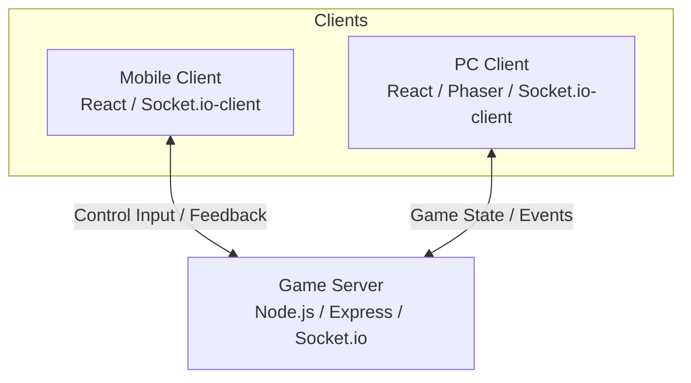

# 爆転振動！バイブレード (Bakuten Shindo! Viblade)

「爆転振動！バイブレード」は、PCをメインのゲーム画面、スマートフォンをコントローラーとして使用する、新感覚のマルチプレイヤー対戦ゲームです。

## コンセプト

- **PC = ゲームスタジアム**: 大画面でダイナミックなバトルを展開。
- **スマホ = モーションコントローラー**: QRコードで瞬時に接続。スマホを振ってベイを発射し、傾けて操作します。
- **リアルなフィードバック**: 衝突や場外際での緊張感を、スマホの振動（Haptic Feedback）で体感。

## システム構成



1.  **Game Server**: 全てのルーム管理とプレイヤーの同期を司ります。
2.  **PC Client**: Phaserを使用した物理演算と描画を行い、ゲームのメイン画面を提供します。
3.  **Mobile Client**: センサー（加速度・ジャイロ）を利用して操作データを送信し、サーバーからのイベントに応じて振動します。

## 主な機能

- **QRコード接続**: PC画面のQRをスマホで読み取るだけでルームに参加可能。
- **モーション発射**: スマホを力強く振ることでベイをシュート。
- **直感操作**: スマホの傾きに合わせてベイがアリーナを縦横無尽に駆け巡ります。
- **マルチプレイヤー**: 最大8人までの同時対戦に対応。

## 技術スタック

- **Frontend (PC)**: React, Phaser 3, Vite, TypeScript
- **Frontend (Mobile)**: React, Vite, TypeScript, Tailwind CSS
- **Backend**: Node.js, Express, Socket.io, TypeScript

## ディレクトリ構成

- `/server`: Node.js ゲームサーバー
- `/pc-client`: PC用ゲーム画面（Phaser実装）
- `/mobile-client`: スマホ用コントローラー画面
- `/documents`: 設計ドキュメント類

## セットアップと起動

### 1. 依存関係のインストール

プロジェクトの各ディレクトリで `npm install` を実行します。

```bash
# サーバー
cd server
npm install

# PCクライアント
cd ../pc-client
npm install

# モバイルクライアント
cd ../mobile-client
npm install
```

### 2. 起動

それぞれのディレクトリで開発サーバーを起動します。

```bash
# サーバー (Port: 3001)
cd server
npm run dev

# PCクライアント (Port: 5173 など)
cd pc-client
npm run dev

# モバイルクライアント (Port: 5174 など)
cd mobile-client
npm run dev
```

※ モバイルクライアントを実機でテストする場合、PCと同じLAN内に接続し、サーバーのローカルIPアドレスを指定する必要があります。

---
Produced by Antigravity
